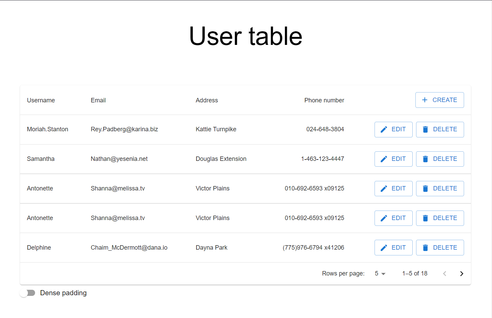

# Probation user list

Simple web application using React. Display a list of users. Possible to add, remove and update users.
User attributes are the following: username, email address, and phone number.
Used:
* [Vite](https://vitejs.dev/)
* [Redux Toolkit + RTK Query](https://redux-toolkit.js.org/)
* [Material UI](https://mui.com/material-ui/api/circular-progress/#main-content)
* [JSON-server](https://github.com/typicode/json-server#plural-routes)
* [styled-components](https://mui.com/material-ui/guides/styled-engine/#main-content)

To run the application for the first time, install the dependencies using the command `yarn install`, after that start dev server with command `yarn dev` and local back-end with command `json-server --watch db.json`.

